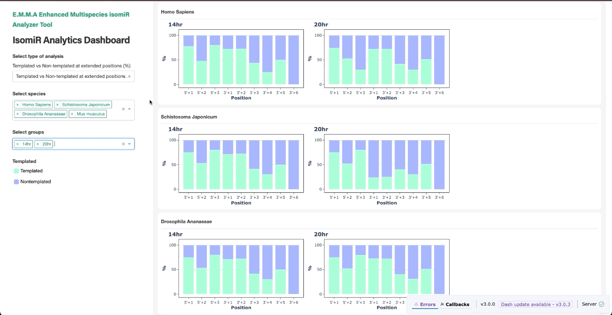

# How to run the program

## Authors

Emma Nguyen, Dayna Sais

## Description

We develop a program that takes miRNA sequencing reads as input files. These reads may belong to different replicates of different groups such as treatment, stages, timepoints, etc.

The outputs:

- Additional information added to existing output files of isomiR-SEA software, including: annotation, number of nt difference at each end, number of snps. We provide a simiplied annoation, catergorisation and visualisation of isomiRs.

- A set of visualisations that provide insights into the isomiR data:

  Graph 1: RPM and relative abundance of isomiRs vs miRNAs in different groups, with a canonical:isomiR ratio for each group

  Graph 2: RPM and unique tags of isomiR types (3`end, 5`end, both ends, canonical and others) in different groups.

  Graph 3: RPM and unique tags of isomiR types (addition/truncation + nt) in different groups.

  Graph 4: Proportion of templated vs nontemplated at addition positions in different groups.

  Graph 5: Proportion of nucleotides (A, U, C, G) at addition positions in different groups.

  Graph 6: Proportion of templated vs nontemplated at all positions for all isomiRs in different groups.



## Installation

### Installing directly to your machine

1. Install Python [here](https://www.python.org/downloads/) and R [here](https://cran.r-project.org/).

2. Install Python packages.

Navigate the terminal to the project folder and type this command:

```
pip install -r ./requirements.txt
```

3. Install R packages ggplot2, patchwork, dplyr, ggrepel, tidyr: just uncomment the first line of code in 9_visualise.R to install, then comment again once the installation is done.

4. bedtools [here](https://bedtools.readthedocs.io/en/latest/content/installation.html)

5. miranda [here](https://anaconda.org/bioconda/miranda)

### Using Docker

1. Install Docker [here](https://docs.docker.com/engine/install/).

2. Pull our public Docker image and start a container.

Navigate the terminal to the project folder and type this command:

```
docker run -dit -p 8050:8050 --name emma-isomir -v "$(pwd)":/emma thaogum/emma-isomir
```

The above command will pull "thaogum/emma-isomir" image, start a container named "emma-isomir", and synchronise all data and code inside the project folder in your host machine with "emma" folder in the container.

3. Access the terminal of the container to use the software.

```
docker exec -it emma-isomir /bin/bash
```

This command allows you to access and interact with the "emma" folder in the Docker container, where you can run the software.

**Note**: We also provide the Dockerfile so that you can build the image yourself.

## Run the program

1.  Put all outputs of isomiR-SEA in one folder: In this folder, there could be one or multiple subfolders, each represents a group (treatment, stage, time points, etc.) which contains one or multiple replicates.

    For example: We provided an example folder /test/mouse/isomiR-SEA_outputs. There are 2 time points (D0 and 18hr). Each group has two replicates: D0 includes D0_rpt1.txt and D0_rpt2.txt and 18hr includes 18hr_rpt1.txt and 18hr_rpt2.txt. An additional example folder /test/s.jap/isomiR-SEA_outputs has also bene provided.

    ```
    ./test
        /mouse
            /isomiR-SEA_outputs
                /18hr
                    /18hr_rpt1.txt
                    /18hr_rpt2.txt
                /D0
                    /D0_rpt1.txt
                    /D0_rpt2.txt
    ```

    Then in the ./run.sh file, set path_raw_output_folder = <path to that folder>
    For example:

    ```bash
    path_raw_output_folder=./test/mouse/isomiR-SEA_outputs
    ```

2.  Set up genomic data: In order to get the precursor sequences extended from both sides of miRNAs, we need:

    - Genome sequence: A fasta file from users.
    - miRNA annotation: (1) gff file from miRBase or (2) an excel file from users which must have _chr_, _name_, _start_, _end_, _strand_ columns.

    If using a gff file from miRBase ensure that the fasta file with genomic sequences is the same genome file used for miRNA annotation; specific genomes used for annotation can be found on miRBase.

    Hence, there are two possible cases. We provided sample files for both cases (for 2nd case, download genome fasta for Schistosoma japonicum [here](https://parasite.wormbase.org/Schistosoma_japonicum_prjea34885/Info/Index), rename to _s.jap.fa_, save into ./test/s.jap/). Here are detailed setting up steps for each case:

    **Case 1:** Fasta file from users and gff file from miRBase.

    - Put the fasta genome from users and gff file from miRBase in a folder.

      For example:

      ```
      /test
        /mouse
            /mmu.fa
            /mmu.gff3
      ```

    - Modify /run.sh file.

      For example:

      ```bash
      path_genomic_file=./test/mouse/mmu.fa
      path_coords_file=./test/mouse/mmu.gff3
      path_raw_output_folder=./test/mouse/isomiR-SEA_outputs
      ...
      is_mirbase_gff=True
      match_chr_names=True # If chromosomes between two files match already, match_chr_names should be False to save computational time.
      ```

    **Case 2:** Fasta file from users and an excel file from users.

    - Put the fasta genome and an excel file from users in a folder.

      For example:

      ```
      /test
        /s.jap
          /s.jap.fa
          /s.jap.xlsx
      ```

    - Modify ./run.sh.

      For example:

      ```bash
      path_genomic_file=./test/s.jap/s.jap.fa
      path_coords_file=./test/s.jap/s.jap.xlsx
      path_raw_output_folder=./test/s.jap/isomiR-SEA_outputs
      ...
      is_mirbase_gff=False
      match_chr_names=True # If chromosomes between two files match already, match_chr_names should be False to save computational time.
      ```

3.  Run ./run.sh file

    ```bash
    bash run.sh
    ```
