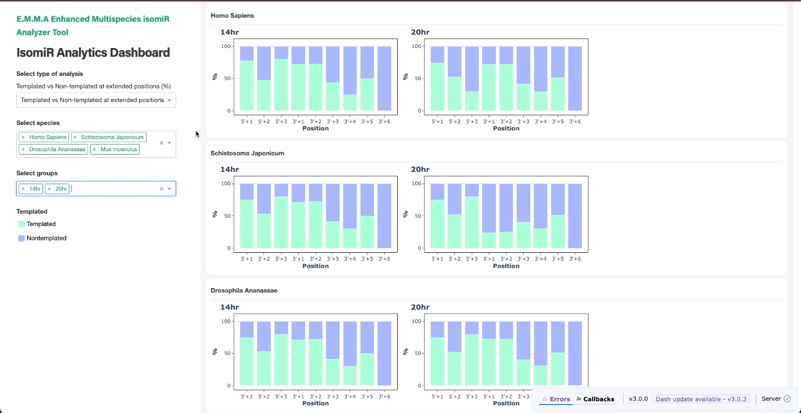

# How to run the program

## Authors

Emma Nguyen, Dayna Sais

## Description

We develop a program that takes miRNA sequencing reads as input files. These reads may belong to different replicates of different groups such as treatment, stages, timepoints, etc.

The outputs:

- Additional information added to the existing output files of the isomiR-SEA software, including annotation, the number of nucleotide differences at each end, and the number of SNPs. We also provide a simplified unique naming system, categorisation, and visualisation of isomiRs.

- A set of visualisations that provide insights into the isomiR data:

  Graph 1: RPM and relative abundance of isomiRs vs miRNAs in different groups, with a canonical:isomiR ratio for each group.

  Graph 2: RPM and unique tags of isomiR types (3`end, 5`end, both ends, canonical and others) in different groups.

  Graph 3: RPM and unique tags of isomiR types (addition/truncation + nt) in different groups.

  Graph 4: Proportion of templated vs nontemplated at addition positions in different groups.

  Graph 5: Proportion of nucleotides (A, U, C, G) at addition positions in different groups.

  Graph 6: Proportion of templated vs nontemplated at all positions for all isomiRs in different groups.



## Installation

1. Install [Python](https://www.python.org/downloads/)

2. Install [Conda](https://docs.conda.io/projects/conda/en/latest/user-guide/install/index.html) and create an seperate environment to run this program (optional but recommended). 

```
conda env create -n emmaenv -f environment.yml
```

3. Activate the conda environment. 
```
conda activate emmaenv
```

## Run the program

1. Open a terminal in this project directory and run the main program: 
```
cd code 
python main.py
```

2. Follow the on-screen instructions.

## Input and Parameter Options

- Ensure you provide all required files as instructed. These include isomiR-SEA output txt files, genomic.fa, UTR.fa, and miRNA_annotation file in GFF3 format. 

- Place all output files from isomiR-SEA in one folder. In this folder, there can be one or multiple subfolders, each represents a group (e.g treatment, stage, time points, etc.) which contains one or more replicates. 

    ### Example Input Datasets
We provide example datasets organized by species inside the `input/` directory. Each species folder contains an `isomiR-SEA_outputs/` directory split into biological groups, the user must provide genomic, UTR and miR_annotation files:

    An additional example folder /input/s.jap/isomiR-SEA_outputs has also been provided.

    ```
    ./input
        /hsa
            /isomiR-SEA_outputs
                /control
                    /SRR33820124 out_result_mature_21_tag_unique.txt
                    /SRR33830125 out_result_mature_21_tag_unique.txt
                /test
                    /SRR3380122 out_result_mature_21_tag_unique.txt
                    /SRR33830123 out_result_mature_21_tag_unique.txt
        /mmu
            /isomiR-SEA_outputs
                /control
                    /un_rpt1.txt
                    /un_rpt2.txt
                    /un_rpt3.txt
                    /un_rpt3.txt
                /test
                    /6hr_rpt1.tct
                    /6hr_rpt2.txt
                    /6hr_rpt3.txt
                    /6hr_rpt4.txt

    ```

- Ensure the genome file and miRNA annotation file are compatible.

- Read count threshold: The minimum average count of an isomiR across all replicates. IsomiRs with average counts below this threshold will not be included in downstream analyses.

- miRNA_annotation file: Y/y (the miRNA_annotation file is a gff3 file downloaded from miRBase) and N/n (your custom excel file).
The custom excel file from users must have _chr_, _name_, _start_, _end_, _strand_ columns.

- Match gff to genome: Y/y (match the chromosome names between the genome file and the miRNA annotation file) and N/n (skip this step, assuming the chromosome names already match)
If the chromosome names in both files are already identical, it is recommended to set match_chr_names to False to save computational time.

## Data Origin:
The example datasets are derived from publicly available small RNA-seq data fetched from the NCBI Gene Expression Omnibus (GEO) database:
- Human Data (`hsa`): GSE298998
- Mouse Data (`mmu`): GSE263895

  
